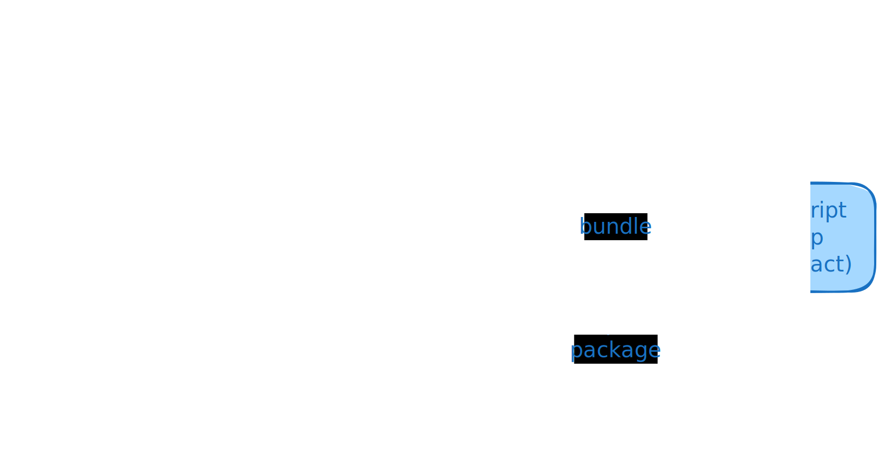

# Web

When we use Crux to build Web apps, the shared core is compiled to WebAssembly.
This has the advantage of sandboxing the core, physically preventing it from
performing any side-effects (which is conveniently one of the main goals of Crux
anyway!). The invariants of Crux are actually enforced by the WebAssembly
runtime.

We _do_ have to decide how much of our app we want to include in the WebAssembly
binary, though. Typically, if we are writing our UI in TypeScript (or
JavaScript) we would just compile our shared behavior and the Crux Core to
WebAssembly. However, if we are writing our UI in Rust we can compile the entire
app to WebAssembly.

## Web apps with TypeScript UI

When building UI with React, or any other JS/TS framework, the Core API bindings
are generated in TypeScript using Mozilla's
[Uniffi](https://mozilla.github.io/uniffi-rs/), and, just like with Android and
iOS we must serialize and deserialize the messages into and out of the
WebAssembly binary.

The shared core (that contains our app's behavior) is compiled to a WebAssembly
binary, using [`wasm-pack`](https://rustwasm.github.io/wasm-pack/), which
creates an npm package for us that we can add to our project just like any other
npm package.

The shared types are also generated by Crux as a TypeScript npm package, which
we can add in the same way (e.g. with `pnpm add`).

This section has two guides for building TypeScript UI with Crux:

1. [TypeScript and React (Next.js)](./nextjs.md)
2. [TypeScript and React (Remix)](./remix.md)
3. [TypeScript and Svelte (Parcel)](./svelte.md)

## Web apps with Rust UI

When building UI with Rust, we can compile the entire app to WebAssembly, and
reference the core and the `shared` crate directly. We do not have to serialize
and deserialize messages, because the messages stay in the same memory space.

The shared core (that contains our app's behavior) _and_ the UI code are
compiled to a WebAssembly binary, using the relevant toolchain for the language
and framework we are using. We use [`trunk`](https://trunkrs.dev/) for the Yew
and Leptos guides and [`dx`](https://dioxuslabs.com/learn/0.4/CLI/installation/)
for the Dioxus guide.

When using Rust throughout, we can simply use Cargo to add the `shared` crate
directly to our app.

This section has three guides for building Rust UI with Crux:

1. [Rust and Yew](./yew.md)
2. [Rust and Leptos](./leptos.md)
3. [Rust and Dioxus](./dioxus.md)
